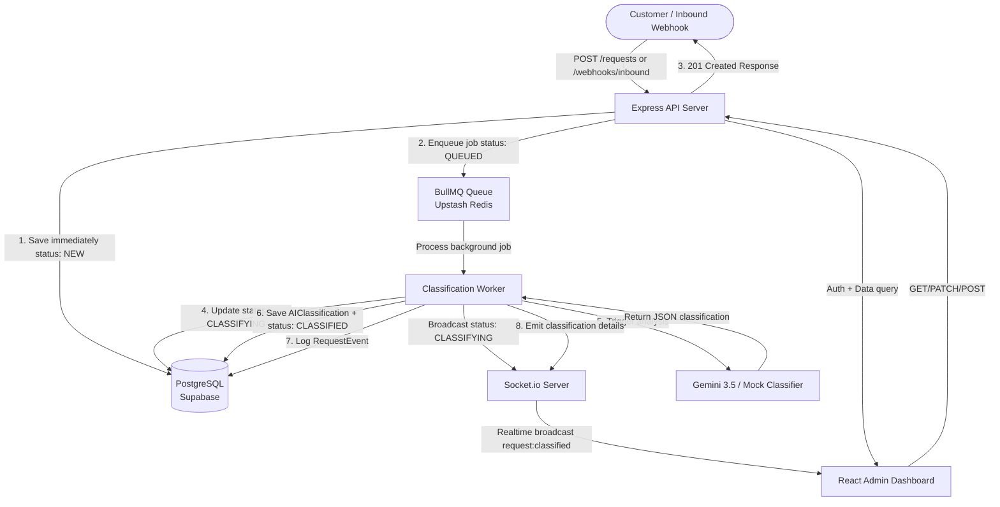

# System Architecture - Sense AI Workflow Ops

The system is designed with an asynchronous processing model to ensure immediate client responses, offloading heavy processing (AI classification) to a background queue, and notifying the client via real-time WebSocket connections when completion occurs.

## System Architecture Diagram

## Architectural Decoupling & Benefits

1. **Immediate response time:** The customer or inbound Webhook (like WhatsApp) never blocks on heavy third-party AI execution. The API responds with `201 Created` within milliseconds, ensuring we don't encounter connection timeouts under load.
2. **Robust background worker queue:** BullMQ manages background processes using Upstash Redis. If the Gemini API key is exhausted or has service disruptions, jobs fail and trigger automatic exponential backoff retries without blocking active dashboard sessions.
3. **Database singleton models:** Prisma client is instantiated once across routes, ensuring connection pooling is managed properly when connecting to cloud-hosted databases (Supabase).
4. **Realtime Socket.io state synchronization:** When the background worker successfully classifies a request, it updates the database and immediately broadcasts the result via Socket.io. The React dashboard updates the card and detail page in-place, eliminating manual screen refreshes.
